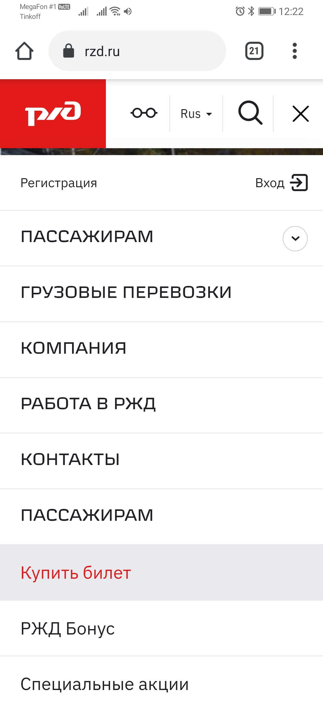
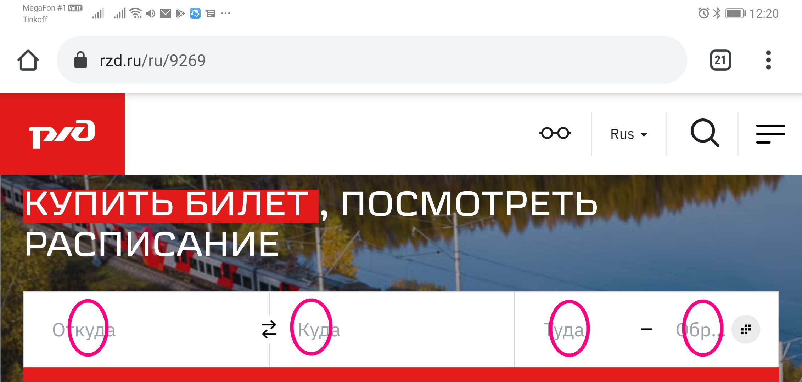
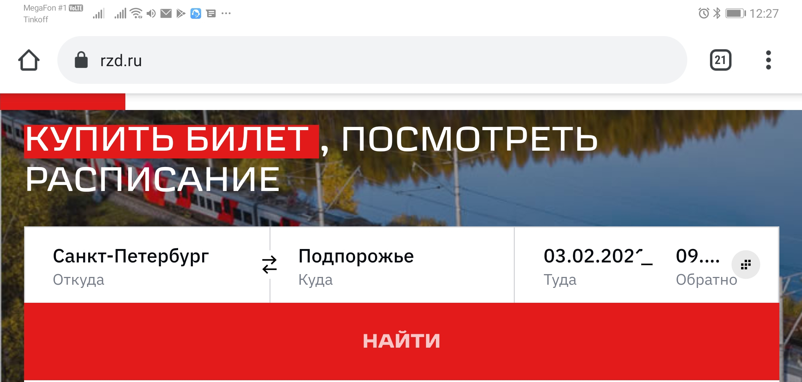
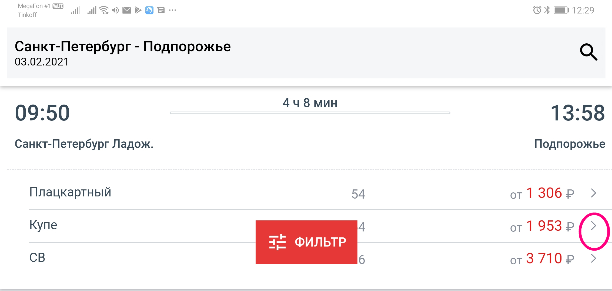
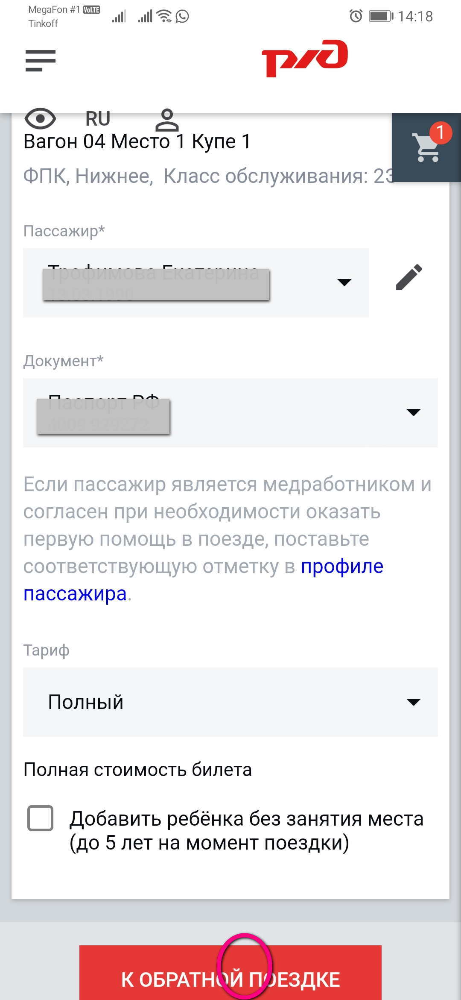

= Инструкция по покупке билета на сайте 'rzd.ru' в формате AsciiDoc.
:Author:    Екатерина Трофимова
:Email:     <tro.tro.katya@gmail.com>
:asciidoc-version: 1.5.3
:download-root: https://github.com/PeacockTeam/new-job/blob/master/rzd_manual

== Регистрация
. Чтобы выполнить покупку билета с помощью сайта необходимо открыть браузер на пк или мобильном устройстве и перейти https://rzd.ru[на сайт 'rzd.ru']. 
. Пройти регистрацию. 

=== Заполнение форм
 
. Далее перейти в раздел.

. Далее заполнить формы покупки билета.

. На введенные даты выбрать вариант поездки из предложенных.
. При заполнении данных пользователя, указать электронную почту, доступную в данный момент для проверки входящих писем.
. Если была выбрана дата 'обратно', перейти к заполнению обратного билета.

=== Завершение оформления
. Далее в качестве способа оплаты привязать номер карты, если это не было сделано ранее на данном пк или мобильном устройстве.
. Обязательно дождаться письма с сайта 'rzd.ru' на электронную почту для успешной покупки. Или дождаться смс на номер телефона.

== Глоссарий терминов для инструкции
[width="100%",options="header"]
|=======================
|Термин | Определение
|Билет | оплаченный заказ, включающий в себя ж/д Билет с пройденной регистрацией и Посадочный купон на поезд, высланные в письме.
|Браузер | Google Chrome и Internet Explorer или другая программа, которая используется на компьютере для поиска информации в интернете.
|Карта | банковская карта, подключенная к Google Pay на мобильном устройстве, или реквизиты банковской карты.
|Форма | блок в браузере на сайте 'rzd.ru' с полями-списками и полями-флагами или полями ввода.
|=======================